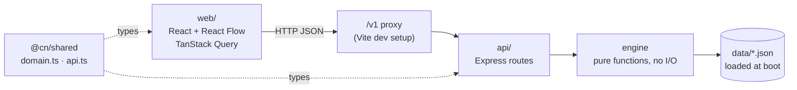

# Civic Task Navigator

PSWB02 — Municipal Bureaucracy Path Visualizer. Internal Hackathon 2026-27.

Opening a small food business in India means working through a string of government portals that never refer to each other: PAN, Gumasta, FSSAI, Udyam, GST, a bank account. Civic Task Navigator takes one plain-language sentence ("I want to open a small restaurant"), matches it to a curated procedure, and turns that procedure into an interactive, dependency-aware roadmap. It shows what you can start today, what is blocked and why, what can run in parallel, and what it will cost and how long it will take. Every step links to the official page it came from and the date it was checked. The engine is deterministic, with no ML: the same input always gives the same roadmap.

## Stack

React 19 + TypeScript + Vite, Tailwind CSS v4, React Flow, TanStack Query · Node 22+ (team standard 24) + Express + TypeScript · JSON files loaded into memory · `node --test` + `tsx`. Types shared by both sides live in the `@cn/shared` workspace.

## Run it locally

Requires Node 22+ (`.nvmrc` pins 24). From the repo root, in PowerShell:

```powershell
npm install                            # installs every workspace
Copy-Item api\.env.example api\.env    # first time only
npm run dev:api                        # API on http://localhost:3001/v1
npm run dev:web                        # web on http://localhost:5173 (second terminal)
npm test                               # API unit and route tests
npm run smoke                          # oracle check against the running API (third terminal)
```

`npm run dev:api` reads `api/.env`. `DATA_DIR` is resolved relative to `api/`, so the default `DATA_DIR=../data` points at this repo's `data/` folder; change it only to load a different dataset. There are no secrets in this project, so `.env.example` is all you need.

The admin routes (`/v1/admin/*`) are unprotected and meant for local use only.

## Repo layout

| Path | What lives there | Owner |
|---|---|---|
| `shared/` | `@cn/shared`: domain and API types imported by both `api` and `web` | M2 (`labels.ts`: M1) |
| `api/` | Express server, routes, dependency engine, data loader and validation | M2 |
| `web/` | React app: task entry, roadmap graph, step panel, admin sources table | M1 |
| `data/` | Procedure dataset, `documents.json`, `expected-roadmaps.json` oracle | M3 |
| `docs/` | The specifications; the source of truth when code and docs disagree | M4 |
| `scripts/` | `smoke.mjs` and other repo scripts | M4 |

## Architecture



The engine reads no clock and uses no randomness. `sourceHealth` is the only date-dependent value, and it is computed at the API boundary, not in the engine. By design (`docs/05` §3, `docs/02` §8), journey progress lives in browser storage under `cn.journey`, and the client re-sends `completedStepIds` on every `POST /v1/roadmap`. The API is stateless and stores nothing.

## Oracle and smoke test

`data/expected-roadmaps.json` is a hand-written oracle containing the expected `Roadmap` for three journeys:

- `jny_demo_baseline`: the demo journey
- `jny_demo_gumasta_completed`: the same journey after the Gumasta step is done
- `jny_high_turnover_gst_included`: a higher-turnover variant where GST applies

With the API running, `npm run smoke` POSTs each journey to `/v1/roadmap` (default `http://localhost:3001`; set `$env:API_URL` to override). It compares stages, the set of step ids, each step's `status`, `stage`, `blockedBy`, `unlocks`, `missingDocumentIds` and `sourceHealth`, the excluded steps, and every `totals` field. Order within lists is ignored. It prints `ALL JOURNEYS MATCH` and exits 0, or lists every mismatch and exits 1. If the engine and the oracle disagree, fix the engine. The oracle changes only through a `contract` issue.

`npm test` runs the API's unit and route tests against small fixture datasets in `api/src/__tests__/fixtures/`. It does not read the oracle.

## Honest scope

> Every step links to the official government page it was checked against, with the date it was checked. Some fees, processing times and sources are still marked UNVERIFIED or portal-level; see the list below. Rules vary by state and sometimes by ward; this is guidance to plan with, not legal advice, and should be confirmed on the linked official page before applying.

Known limits:

- **One procedure.** Only "Open a small food outlet" in Mumbai is modelled. The engine does not depend on the city; only the dataset is limited.
- **Read-only dataset.** `POST /v1/admin/steps/{stepId}/verify` returns `501`. To re-verify a step, edit its `verifiedOn` in `data/`.
- **UNVERIFIED figures.** The fees for the rent agreement, Gumasta, FSSAI and company incorporation are marked UNVERIFIED in the data and count as ₹0 until confirmed, so `totalFeeInr` understates the real cost. Gumasta's processing time and PAN's minimum processing time are also unconfirmed. Each step's `feeNote` and `notes` say which.
- **Portal-level sources.** The Gumasta step and its prerequisites, the FSSAI step and its prerequisite, and the Udyam prerequisite link to portal home pages rather than to the page that states the rule.
- **Bank account.** The bank-account step requires both the Udyam and the Gumasta certificates. That appears stricter than RBI's list of acceptable business-proof documents for proprietorships (to be confirmed).

## Team

| Slot | Person | GitHub | Role |
|---|---|---|---|
| M1 | Vivaan | @vivaannk07 | Frontend / Product |
| M2 | Yuti | @yutijain | Backend / Engine |
| M3 | Pahal | @Pahal5 | Data / Curation |
| M4 | Vedika | @vedipanj115 | Integration / QA / Specs |

Vivaan is team leader. Vedika owns the repository and M4.
